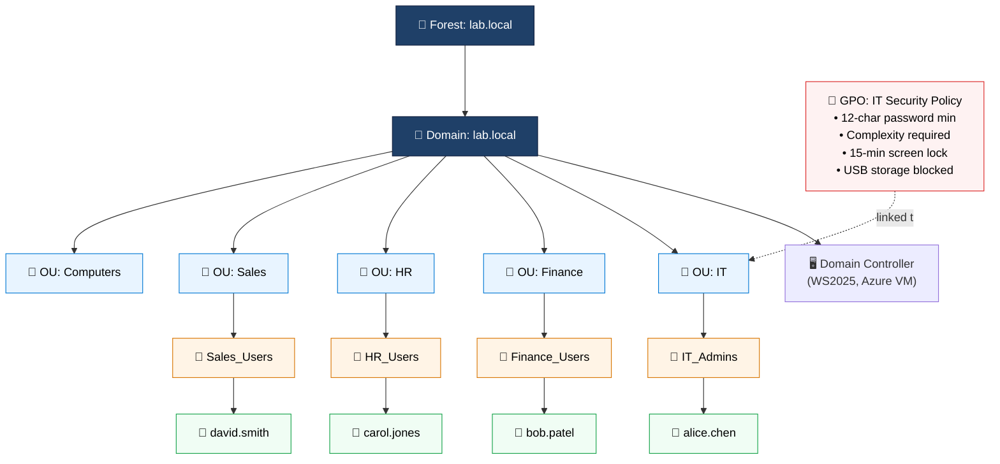
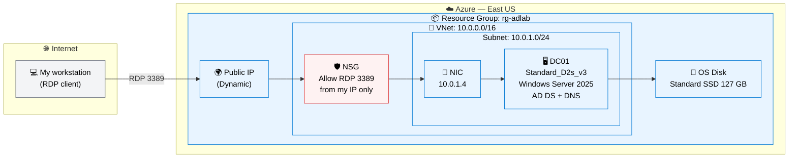

# Active Directory on Windows Server 2025 (Azure)

> Building the identity backbone of a Windows enterprise: a single-forest Active Directory environment on Windows Server 2025, deployed as an Azure IaaS VM, with departmental OUs, role-based security groups, and a hardening GPO.


---

## 🎥 [watch the live demo](https://www.loom.com/share/449f56fb5c4742b6924f0873069e79ad)

---

## Project Goals

This lab had three explicit goals:

1. **Demonstrate end-to-end Active Directory competence** 
2. **Practice the most common Tier-1/Tier-2 IT operations tasks**
3. **Build it in Azure**

---

## The Problem This Solves

Every organization that runs Windows infrastructure needs to answer one question constantly: **Who is allowed to do what?** Active Directory is the system of record for that answer: controlling logins, file share access, and policy enforcement across the enterprise. A new hire's group membership grants email, drives, printers, and apps automatically; an offboarded employee's single disabled account closes every door at once.

AD is also the number-one target in ransomware operations because compromising a Domain Controller compromises everything that trusts it. Knowing how to build it correctly is the first step to knowing how to defend it.

---

## Architecture

### Logical Architecture

The directory hierarchy I built inside the `lab.local` forest:



### Azure Deployment Architecture

How the lab actually sits in Azure:



---

## Tech Stack and Why

| Layer | Choice | Why |
|---|---|---|
| **Cloud platform** | Azure (pay-as-you-go subscription) | Native fit for Windows Server; on-prem AD knowledge maps cleanly onto Entra ID for hybrid identity. PAYG was necessary because free-trial subscriptions cannot request quota increases. That would have blocked the SKU troubleshooting in Decision 1. Actual cost stays low (single-digit dollars per session) with VMs deallocated between uses. |
| **Compute** | Azure VM, `Standard_D2s_v3` (East US, Zone 3) | Originally specified as `B2s` (retired). The architecturally correct successor `B2s_v2` was unavailable in East US for my subscription tier. Deployed on D2s_v3 in Zone 3 as the available alternative. See Decision 1 for full trade-offs. |
| **Operating system** | Windows Server 2025 Datacenter (Gen2) | Latest GA release, 180-day eval license, current AD DS schema (v88), modern Server Manager. |
| **Identity service** | Active Directory Domain Services (AD DS) | The subject of the lab. Installed as a Windows Server role, promoted via `Install-ADDSForest`. |
| **DNS** | AD-integrated DNS (installed during promotion) | Required by AD. Clients locate the DC via SRV records. Co-locating DNS on the DC is standard for single-DC environments. |
| **Policy enforcement** | Group Policy Management Console (GPMC) | Installed alongside AD DS. Without `Install-WindowsFeature -Name GPMC`, the console doesn't appear in Server Manager; a common stumbling block. |
| **Automation** | PowerShell(`ActiveDirectory`, `GroupPolicy` modules) | Used for OU creation, user provisioning, group membership, and audit reporting. Scripted provisioning is reproducible and scales beyond a few users. |
| **Remote access** | RDP (TCP 3389) over Public IP, NSG-restricted | Lab-grade access. Production would use Azure Bastion. See trade-offs below. |
| **Networking** | Single VNet/subnet, NSG allowing RDP from my source IP only | Minimal viable network. Source IP restriction is the one non-negotiable hardening step, even for a lab. |

---

## Steps

This lab builds a complete single-forest Active Directory environment from a bare Windows Server 2025 VM in Azure. Concretely, the build proceeds through six phases:

1. **Provision the VM.** Deploy a Windows Server 2025 Datacenter VM into a dedicated resource group, with NSG rules restricting RDP to a single source IP.
2. **Install AD DS and GPMC roles.** Add Active Directory Domain Services and the Group Policy Management Console as Windows Server roles, both via PowerShell, with the GUI as backup.
3. **Promote to Domain Controller.** Create a new forest (`lab.local`), install AD-integrated DNS, and become the authoritative identity server for the domain.
4. **Build the organizational structure.** Create departmental OUs (IT, Finance, HR, Sales, Computers), role-based security groups, and four test user accounts, all scripted in PowerShell to demonstrate reproducible identity provisioning.
5. **Author and apply Group Policy.** Create an `IT Security Policy` GPO enforcing 12-character passwords, 15-minute screen lock, and USB storage restrictions. Link it to the IT OU to demonstrate scoped policy application.
6. **Practice help-desk operations.** Execute the canonical Tier-1/Tier-2 tasks; password resets, account unlocks, employee offboarding, inactive-account audit queries using PowerShell.

---

## Validation

After the build, the directory was verified with:

```powershell
# Confirm the DC is running and the forest exists
Get-ADDomainController

# Confirm all 5 OUs
Get-ADOrganizationalUnit -Filter * | Select-Object Name, DistinguishedName

# Confirm all 4 users are enabled
Get-ADUser -Filter {Enabled -eq $true} | Select-Object Name, SamAccountName

# Confirm group membership
Get-ADGroupMember -Identity IT_Admins

# Confirm GPO is linked to the IT OU
Get-GPInheritance -Target 'OU=IT,DC=lab,DC=local'
```

GPO application was tested by logging in as `alice.chen` on a domain-joined client, running `gpupdate /force` and `gpresult /r`, and confirming that the 15-minute screen lock took effect.

---

## Cleanup(optional)

To avoid burning free-tier credits between sessions:

```bash
# Stop the VM (compute billing pauses; storage still bills minimally)
az vm deallocate --resource-group rg-adlab --name DC01
```

To tear the lab down entirely:

```bash
# Delete the resource group and everything in it
az group delete --name rg-adlab --yes --no-wait
```

---


## Architectural Decisions and Trade-offs

Each decision below was a conscious choice with trade-offs worth being explicit about.

### Decision 1: Compute — `Standard_D2s_v3` in East US, Zone 3

The reference lab specified `Standard_B2s` (burstable v1), which is unavailable in East US because the v1 family is on a retirement path (EOL Nov 2028). The architecturally correct successor is `Standard_B2s_v2`, but when I navigated to **Subscriptions → Usage + quotas** and tried to request an adjustment, the portal returned a "Quota recommendations" wizard with **"Unavailable in this region"**, hence not a quota I could request, but a real Azure capacity decision for my subscription tier. I could have rebuilt in East US 2 or South Central US where Bsv2 is available, but the marginal cost difference for a lab that runs a few hours per session didn't justify it.

Deployed on `Standard_D2s_v3` (general-purpose, 2 vCPU, 8 GB RAM) in **East US, Availability Zone 3**. First deployment attempt also hit a zone restriction, `D2s_v3` is allocated only to Zone 3 in East US for my subscription, not Zone 1, which the portal flagged clearly. Switching the dropdown resolved it. D2s_v3 is over-provisioned for an AD DS lab (idle 95% of the time), but the cost is trivial with the VM deallocated between sessions.

| | `B2s` (specified) | `B2s_v2` (preferred) | `D2s_v3` (deployed) |
|---|---|---|---|
| Family | Burstable v1 | Burstable v2 | General-purpose v3 |
| vCPU / RAM | 2 / 4 GB | 2 / 8 GB | 2 / 8 GB |
| CPU credit model | Yes | Yes | No (sustained) |
| East US availability (my subscription) | ❌ Retiring | ❌ Unavailable in region | ✅ (Zone 3 only) |
| Right fit for AD DS lab? | Yes (if available) | **Yes** | Over-provisioned but workable |

> Azure capacity is a three-dimensional problem: **region × availability zone × subscription tier**. The decision was between "good enough and deployed" vs "perfect and still being requested."

### Decision 2: Single Domain Controller, single forest

One DC, one domain (`lab.local`), one forest. This is a single point of failure. If `DC01` goes down, the entire directory is unavailable. In production this would be disqualifying; Microsoft's guidance is a minimum of two DCs per domain. For a learning lab, the promotion process, OU design, GPO authoring, and provisioning are identical whether there's one DC or twenty, so the cost of a second DC isn't justified.

### Decision 3: `.local` TLD instead of a routable domain

`.local` is reserved by RFC 6762 for mDNS, and Microsoft has discouraged its use for AD for over a decade. It can collide with mDNS clients and breaks UPN routing in hybrid Entra ID scenarios. Acceptable here because the lab is isolated. No mDNS, no hybrid sync, no public DNS exposure, and `lab.local` matches the reference materials. **In production:** use a subdomain of a domain you actually own (e.g., `corp.example.com`).

### Decision 4: DNS co-located on the Domain Controller

AD-integrated DNS installed during promotion running on the same VM as AD DS. This is the Microsoft-recommended pattern: the DC must register its own SRV records, and AD-integrated zones replicate with directory replication. The trade-off is just acknowledging that DNS health *is* AD health. There is no separation of concerns at this layer, by design.

### Decision 5: Public IP with RDP exposed, source-IP-restricted via NSG

The DC has a public IP and RDP/3389 is opened only from my home IP. Any internet-exposed RDP endpoint is part of the global attack surface, but source-IP restriction reduces exposure by ~99.99% versus an `Any` rule. The lab is short-lived, and there's no production data at risk. **In production:** replace with Azure Bastion, browser-based RDP/SSH over TLS, no public IP on the workload VM, integrates with Entra ID authentication. 

### Decision 6: Single OU-per-department layout

Five flat OUs at the domain root: `IT`, `Finance`, `HR`, `Sales`, `Computers`. Fine for four users; a real org needs a tiered structure (top-level by geography or BU, then nested `Users` / `Groups` / `Workstations` / `Servers`). Flat structures throw away most of GPO inheritance, but they make the lab teachable — every OU visible at once, no inheritance chains to trace. The mental model carries forward to nested structures.

### Decision 7: GPO scoped to `IT` OU only

The `IT Security Policy` GPO is linked only to the `IT` OU. In a real environment, those password and screen-lock policies should apply to everyone. Scoping narrowly here demonstrates the *linking* mechanic explicitly; policy applied to one OU doesn't bleed into siblings. In production: link a baseline security GPO at the domain root, then layer department-specific GPOs at the OU level.

---

## What I'd Do Differently in Production

If I were building this for an actual organization rather than a portfolio lab, the deltas would be:

| Area | Lab approach | Production approach |
|---|---|---|
| **Domain controllers** | 1 DC | Minimum 2 DCs per domain, in different Azure availability zones. Use [Azure Site Recovery](https://learn.microsoft.com/en-us/azure/site-recovery/) or a second region for DR. |
| **Domain name** | `lab.local` | Subdomain of an owned, routable domain (`corp.example.com`). |
| **Compute** | Single VM, Standard SSD | Premium SSD for AD DS database (`ntds.dit`) and SYSVOL — ESE database I/O latency is the bottleneck. Pin DCs to availability zones; do not co-locate replica DCs on the same host. |
| **Remote admin access** | Public IP + RDP + NSG source restriction | Azure Bastion (Standard SKU). No public IPs on workload VMs at all. Just-in-Time VM access via Defender for Cloud for break-glass. |
| **Privileged access** | Single domain admin account used interactively | Tiered admin model (Tier 0 / 1 / 2). Privileged Access Workstations (PAWs) for Tier 0. Microsoft LAPS for local admin password rotation. |
| **Backup** | None | Azure Backup or Recovery Services Vault, system-state backup nightly. Test bare-metal DC restore quarterly. |
| **Monitoring** | None | Microsoft Defender for Identity on every DC. Stream Security event logs to Microsoft Sentinel. Alert on Event IDs 4625 (failed logon), 4740 (lockout), 4768/4769 (Kerberos), 4672 (privileged logon), and anything touching `AdminSDHolder` or `Domain Admins`. |
| **Patching** | Manual | Azure Update Manager with maintenance windows; reboot one DC at a time so authentication never goes dark. |
| **Network** | Single VNet, single subnet, public IP | Hub-and-spoke topology. DCs in a dedicated subnet with NSG rules restricting which subnets can reach 88/389/445/636. No public IPs. Inbound from on-prem via ExpressRoute or VPN Gateway. |
| **Identity strategy** | On-prem AD only | Hybrid: AD on-prem (or in Azure IaaS) synced to Microsoft Entra ID via Entra Cloud Sync. Entra Conditional Access enforcing MFA for all interactive logons. Password Hash Sync as the auth method for resilience. |
| **GPO baseline** | One custom GPO, one OU | Apply the Microsoft Security Compliance Toolkit baselines for Windows Server 2025 and Windows 11 at the domain root, layered with department-specific GPOs. Enforce LSASS protection, Credential Guard, and SMB signing. |
| **Disaster recovery** | DSRM password written down | DSRM passwords rotated quarterly and stored in a privileged secrets vault. Documented forest recovery runbook. |

---


## Skills Demonstrated

- Azure IaaS provisioning, VM sizing decisions, NSG hardening
- Recognizing and adapting to Azure SKU lifecycle events (B-series v1 → v2)
- Windows Server 2025 administration
- Active Directory forest design, OU architecture, role-based access via security groups
- Group Policy authoring, linking, and inheritance
- PowerShell automation for identity lifecycle (`ActiveDirectory` and `GroupPolicy` modules)
- Help-desk operations: password reset, account unlock, offboarding, audit reporting
- Production-vs-lab trade-off analysis

---
